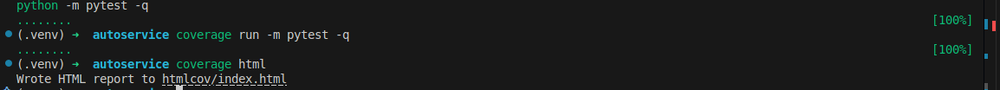
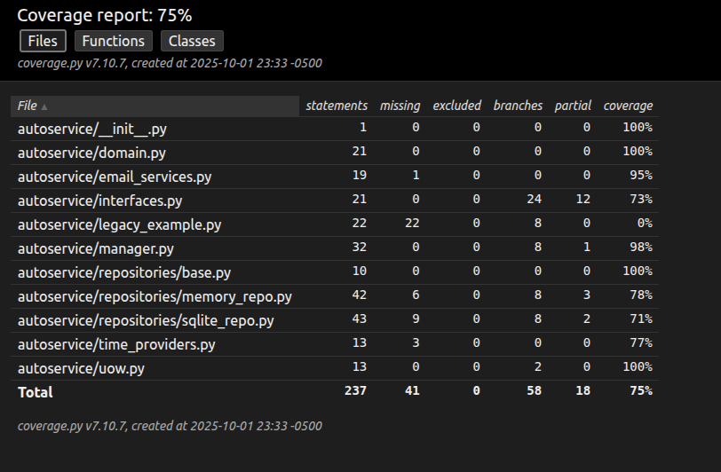
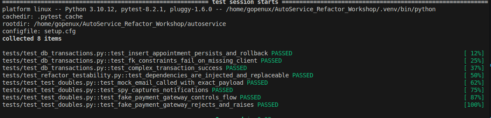

# AutoService – Refactoring de sistema legacy a código testeable

Este proyecto guía paso a paso el refactoring de un sistema de citas para un taller mecánico (**AutoService**) hacia una arquitectura testeable, aplicando:

1) **Pruebas con BD transaccionales**,  
2) **Diseño para testeabilidad (inyección de dependencias)**,  
3) **Test doubles efectivos** (Mock, Spy, Fake, InMemory).

Incluye **pytest**, **coverage** y ejercicios autocontenidos.

## Estructura

```
autoservice/
├── autoservice/
│   ├── __init__.py
│   ├── domain.py
│   ├── interfaces.py
│   ├── manager.py
│   ├── time_providers.py
│   ├── email_services.py
│   ├── uow.py
│   └── repositories/
│       ├── base.py
│       ├── sqlite_repo.py
│       └── memory_repo.py
├── scripts/
│   └── init_db.py
├── tests/
│   ├── conftest.py
│   ├── test_db_transactions.py
│   ├── test_test_doubles.py
│   └── test_refactor_testability.py
├── requirements.txt
├── .coveragerc
└── README.md
```

## Comandos rápidos

```bash
# 1) Crear y activar entorno
python -m venv .venv
# Windows: .venv\Scripts\activate
# Linux/macOS:
source .venv/bin/activate

# 2) Instalar dependencias
pip install -r requirements.txt

# 3) (opcional) crear DB local de desarrollo
python -m autoservice.scripts.init_db

# 4) Ejecutar tests con cobertura
pytest -q --maxfail=1 --disable-warnings
coverage run -m pytest -q
coverage html
# Abra htmlcov/index.html en su navegador

# 5) Medir complejidad ciclomática (antes/después)
radon cc autoservice -s -a
```

!





